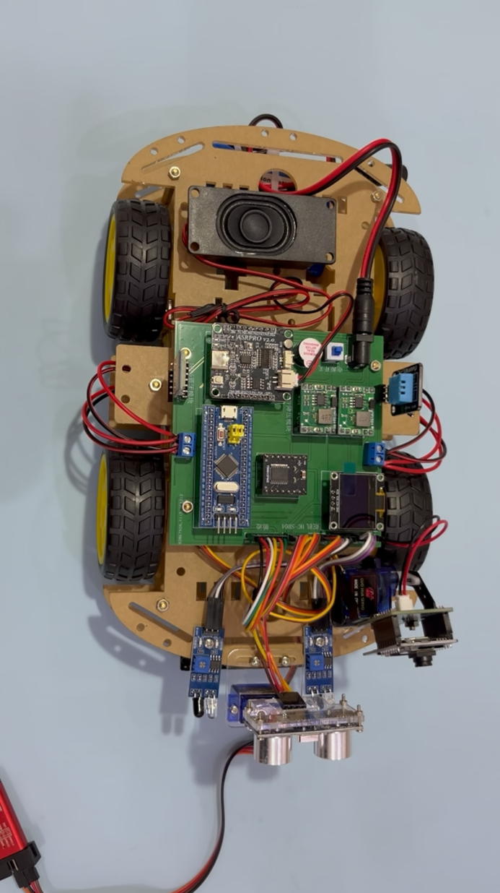
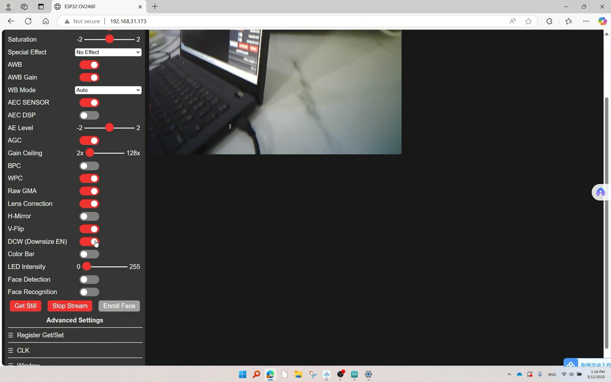

# 基于 STM32 的智能多功能小车系统

## 项目简介

本项目基于 STM32 最小系统板设计实现一套智能多功能小车系统，集成超声波避障、四路红外循迹、蓝牙遥控、离线语音控制、ESP32-CAM 视频监控以及 MPU6050 手势体感控制等功能。

系统采用模块化设计，实现了多种控制方式与传感器融合，可用于嵌入式学习、智能车控制以及单片机项目开发。

---

# 项目功能

## 1. 超声波自动避障
- 使用 HC-SR04 超声波模块实时测距
- 检测前方障碍物距离
- 自动调整小车运动方向实现避障

## 2. 四路红外循迹
- 使用四路红外传感器检测黑线轨迹
- 根据不同轨迹状态动态调整左右轮速度
- 实现稳定循迹功能

## 3. 蓝牙遥控
- 基于蓝牙串口通信实现手机遥控
- 支持前进、后退、左转、右转、停止等操作

## 4. ASRPRO 离线语音控制
- 接入 ASRPRO 语音识别模块
- 支持固定语音指令控制小车运动
- 无需联网即可完成语音识别

## 5. ESP32-CAM 视频监控
- 使用 ESP32-CAM 实现无线视频传输
- 支持局域网实时查看视频画面

## 6. MPU6050 手势体感控制
- 使用 MPU6050 获取姿态数据
- 通过蓝牙发送控制指令
- 支持前倾前进、左右倾斜转向等体感控制功能

---

# 硬件平台

- STM32 最小系统板
- HC-SR04 超声波模块
- 四路红外循迹模块
- L298N 电机驱动模块
- ESP32-CAM
- MPU6050
- ASRPRO 语音识别模块
- 蓝牙模块
- 直流减速电机

---

# 软件设计

## 使用技术
- C语言
- STM32
- GPIO
- PWM
- UART
- I2C

## 开发环境
- Keil5
- STM32CubeMX（如使用可写）
- 串口调试助手

---

# 项目展示

## 小车实物

## 视频监控界面

## 手势控制演示
（这里放图片）

---

# 项目亮点

- 集成多种控制方式（蓝牙 / 语音 / 手势）
- 支持自动避障与智能循迹
- 实现 ESP32-CAM 无线视频监控
- 采用模块化设计，便于后期扩展功能

---

# 作者

本科软件工程，自学嵌入式开发与 STM32 单片机。
